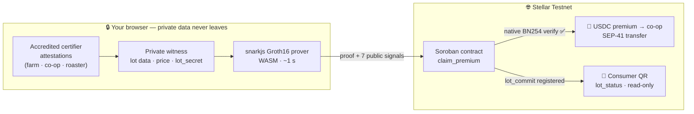
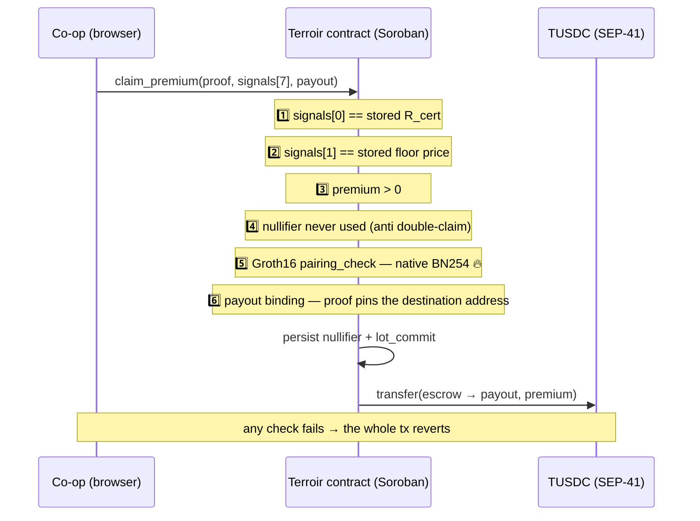
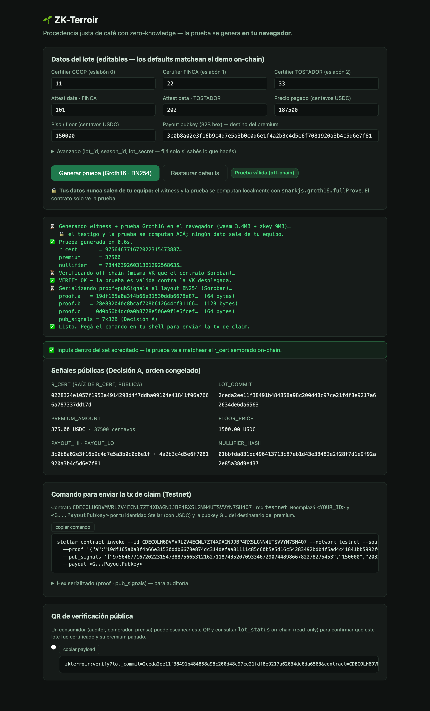

<div align="center">

# ☕ ZK-Terroir

### Fair coffee provenance — provable, private, and paid on-chain.

**A cooperative proves its coffee passed through a chain of accredited certifiers and was bought
above a fair floor price — and gets paid a USDC premium on Stellar — without revealing a single
supplier.**

[](https://stellar.expert/explorer/testnet/contract/CDECOLH6DVMVRLZV4ECNL7ZT4XDAGNJJBP4RXSLGNN4UTSVVYN7SH4O7)
[](contracts/terroir)
[](circuits/terroir_chain.circom)
[](circuits)
[](web)
[](deployments/testnet.json)
[](LICENSE)

*Built for **Stellar Hacks: Real-World ZK** — powered by Stellar's brand-new native BN254
host functions (Protocol 25 & 26).*

</div>

---

## 🎥 Demo video

<!-- ═══════════════════════════════════════════════════════════════════
     ADD DEMO VIDEO HERE — replace this block with the YouTube link:
     [](https://www.youtube.com/watch?v=VIDEO_ID)
     ═══════════════════════════════════════════════════════════════════ -->

> 🎬 **Demo video coming here** — in-browser proof generation → on-chain BN254 verification →
> USDC premium payout → consumer QR verification. *(2–3 min)*

---

## The 30-second pitch

> *This coffee says it's fair-trade. Do you believe it? Right now, all you have is a logo.*
>
> With ZK-Terroir, you scan a QR and see a **mathematical proof** that every link — farm, co-op,
> roaster — was certified by an accredited body, and that the producer was paid **above the fair
> floor price**. The premium lands in the cooperative's wallet in **USDC, on-chain, in the same
> transaction that verifies the proof**. And the brand revealed **zero suppliers** — the proof was
> generated in the browser, and the private data never left the machine.
>
> **Trust without nakedness.**

Ethical supply chains live a contradiction: to be trusted, a brand should open its chain — but the
chain (*who* it buys from, at *what* price) **is** its competitive edge. Opening it gives away the
business; not opening it is unprovable greenwashing. Zero-knowledge dissolves the contradiction:
**prove the predicate, hide the chain.**

---

## How it works



The circuit ([`circuits/terroir_chain.circom`](circuits/terroir_chain.circom)) proves, in one
Groth16 proof:

1. **Chain of custody** — three attestation leaves (farm → co-op → roaster) are members of the
   certifier Merkle root `R_cert`, each leaf **role-tagged** in its Poseidon preimage, so links
   can't be substituted or omitted across roles.
2. **Fair price** — `price_paid ≥ floor`, with `price_paid` committed inside an accredited leaf and
   `floor` pinned in the contract, so **both ends of `premium = price_paid − floor` are
   cryptographically fixed**. Nobody can inflate the payout.
3. **One claim per lot** — a nullifier `Poseidon(lot_secret, season)` makes double-claiming
   impossible; the season is fixed by the attestation itself, killing the residual replay path.

### What the contract enforces (all in one atomic transaction)



| # | Public signal | Bound to |
|---|---|---|
| 0 | `r_cert` | Merkle root of accredited certifiers, published by the admin |
| 1 | `floor_price` | Fair floor price pinned in contract storage |
| 2 | `lot_commit` | Public lot commitment — what the consumer's QR queries |
| 3 | `premium_amount` | `price_paid − floor`, computed *inside* the circuit |
| 4–5 | `payout_hi` / `payout_lo` | The payout address split in halves — funds can only go where the proof says |
| 6 | `nullifier` | `Poseidon(lot_secret, season)` — one claim per lot per season |

**What stays private:** who the suppliers are, which specific attestations were used, the lot's
identity data, `lot_secret`. **What goes public:** the root, the floor, the premium claimed, the
lot commitment, and the payout address — nothing that names a link in the chain.

---

## ⚡ Why Stellar — and why *now*

This project exists because of Stellar's newest cryptography, and the ZK is **load-bearing** — not
decoration:

- **Native BN254 `pairing_check`** (Protocol 25, live Jan 2026) verifies the Groth16 proof
  **on-chain, inside the host** — no interpreted-WASM pairing math.
- **Native `g1_mul` / `g1_add`** (Protocol 26, live May 2026) compute the public-input linear
  combination.
- The whole verifier + escrow + payout logic compiles to a **10 KB Wasm contract**
  ([`contracts/terroir/src/lib.rs`](contracts/terroir/src/lib.rs), ~390 lines, soroban-sdk 25.1.0).
- Poseidon lives **only inside the circuit** (circomlib); the contract treats roots and nullifiers
  as opaque field elements the SNARK already validated. Minimal trusted surface on-chain.
- The payout is a plain **SEP-41 transfer** from the contract's escrow — proof verification and
  payment are **one atomic transaction**. Privacy with economic purpose: the proof doesn't hide for
  hiding's sake, it **releases real money conditioned on a real-world predicate**.

> **Precision note:** the public-input combination runs native `g1_mul`/`g1_add` in a loop — MSM
> done with native scalar-muls, not a dedicated MSM precompile. With 7 inputs the cost difference is
> irrelevant; the narrative precision isn't.

---

## 🖥️ The wow: proving in your browser



The [`web/`](web) frontend is a **static page with zero backend**: `snarkjs.groth16.fullProve` runs
**in your browser** (~0.7–1 s in Chrome), verifies the proof off-chain against the deployed
verification key, serializes it to Soroban's BN254 layout, and hands you the ready-to-run
`claim_premium` command plus the consumer QR.

**The `lot_secret` and lot data never leave your machine.** The chain only ever sees the proof.

```bash
cd web && python3 -m http.server 8099
# open http://localhost:8099 → "Generate proof" (~1 s)
```

Verified end-to-end: a proof **generated in a real browser** was submitted on-chain, **verified
TRUE, and paid out 375.00 TUSDC** to the co-op wallet on Testnet
([`deployments/testnet.json`](deployments/testnet.json)).

<br clear="right"/>

---

## ✅ What's real / 🟡 what's mocked (honest, for the judges)

| Piece | Status |
|---|---|
| Groth16 **BN254 verification, native on-chain** (P25 `pairing_check` + P26 `g1_mul`/`g1_add`) | ✅ **REAL** on Testnet |
| 3-link circuit (3× role-tagged Merkle membership + range + nullifier), **audited sound** | ✅ **REAL** ([`circuits/terroir_chain.circom`](circuits/terroir_chain.circom)) |
| Premium payout in **SEP-41** from contract escrow | ✅ **REAL** — E2E: happy path / replay blocked / tampered proof blocked |
| Anti double-claim (persistent nullifier) + anti-inflation (pinned floor) + payout binding | ✅ **REAL**, audited |
| In-browser proving (static page, no backend, no CDNs) | ✅ **REAL** — headless-Chrome smoke test in [`web/browser_test.mjs`](web/browser_test.mjs) |
| Chain-of-custody roles farm→co-op→roaster | ✅ **REAL** (role committed in each leaf's Poseidon preimage → no substitution/omission). Strict *temporal* ordering is future work |
| Certifier attestation issuer | 🟡 **Honest mock** — in production an oracle would repackage real PKI (X.509/PGP) into credentials; today the issuer is simulated |
| USDC | 🟡 **Test TUSDC** (SAC on Testnet), not mainnet USDC |
| Demo scope | 🟡 **1 cooperative / 1 lot** end-to-end; multi-co-op & multi-region is future work |
| Trusted setup | 🟡 **Toy** — single-contribution Powers-of-Tau with hardcoded entropy. Fine for an MVP; **production demands a multi-party ceremony** |

Adversarial tests live next to the circuit: [`double_spend_attack.js`](circuits/double_spend_attack.js),
[`role_swap_attack.js`](circuits/role_swap_attack.js), [`tamper_test.js`](circuits/tamper_test.js) —
each attack must **fail** to prove. The contract ships 11 tests including fixtures with a **real
proof** (happy path, replay, tampered proof, wrong root, wrong floor, payout binding, admin auth).

---

## 🚀 Run it

```bash
# 0) The 60-second demo — in-browser proving, no toolchain needed
cd web && python3 -m http.server 8099    # open http://localhost:8099

# 1) Circuit: generate a proof and verify off-chain (snarkjs via npx)
cd circuits && npm ci                    # exact pins: circomlib 2.0.5 / circomlibjs 0.1.7
./gen_proof.sh
npx snarkjs groth16 verify verification_key.json public.json proof.json   # -> OK

# 2) Contract: build + full test suite (includes real-proof fixtures)
cd ../contracts/terroir && cargo test && stellar contract build

# 3) Deploy + TUSDC escrow on Testnet (addresses land in deployments/testnet.json)
cd ../.. && ./scripts/setup_token.sh && ./scripts/deploy.sh

# 4) Consumer-side verification (read-only, no keys with write access)
cd verify && ./verify.sh <lot_commit_hex>          # see verify/README.md
```

**Reproducibility:** heavy artifacts (`*.ptau` / `*.zkey` / `*.wtns`) are gitignored and regenerate
via `gen_proof.sh` — **except** [`web/public/terroir_chain_0001.zkey`](web/public), which is
deliberately tracked: the trusted setup is non-deterministic, so this zkey is the *only* link to the
deployed verification key (VK matches `lib.rs` byte-for-byte). The VK, `proof.json`, `public.json`
and `serialized.json` are committed, so on-chain verification is reproducible without regenerating
the circuit.

---

## 🌐 Live on Stellar Testnet

| | |
|---|---|
| **Contract** | [`CDECOLH6DVMVRLZV4ECNL7ZT4XDAGNJJBP4RXSLGNN4UTSVVYN7SH4O7`](https://stellar.expert/explorer/testnet/contract/CDECOLH6DVMVRLZV4ECNL7ZT4XDAGNJJBP4RXSLGNN4UTSVVYN7SH4O7) |
| **TUSDC (SAC)** | `CDERQSVY6RMWDAQ5N6SAGF7BUBS47B2EUNWJIGRGHXPUKEHQO3CPLRCA` |
| **Wasm** | 10,437 bytes — hash `132cf18d…35d61d` |
| **E2E** | happy path ✅ · replay blocked ✅ · tampered proof blocked ✅ · **browser-generated proof paid 375.00 TUSDC on-chain** ✅ |

All addresses and transaction evidence: [`deployments/testnet.json`](deployments/testnet.json).

---

## 🗺️ Repo map

```
circuits/          Circom circuit (terroir_chain.circom) + snarkjs setup + JS infra (R_cert tree, witness) + attack tests
contracts/terroir  Soroban contract: claim_premium, set_certifier_root, set_floor, lot_status (+ 11 tests)
web/               in-browser proving frontend — static, zero backend (see web/README.md)
verify/            public read-only verifier (consumer QR / lot_status) — bash + stellar CLI, no write keys
scripts/           setup_token.sh (TUSDC SAC + escrow), deploy.sh
deployments/       testnet.json — live addresses + E2E evidence
spike/             day-1 spike: generic Groth16/BN254 verification on-chain (the validated foundation)
```

---

## 🔭 Roadmap

- **Association-set double-membership** (2-level ASP design, frozen) — certifier accreditation as
  its own provable layer.
- **Multi-party trusted-setup ceremony** to replace the toy Powers-of-Tau.
- **Real certifier PKI bridge** — an oracle repackaging X.509/PGP certificates into attestations.
- **Multi-cooperative / multi-region** roots and strict temporal ordering of custody links.
- **Wallet integration** — one-click sign & claim from the browser (today the page hands you the
  CLI command; the ZK already happened client-side).

---

<div align="center">

**ZK-Terroir** · fair provenance, provable, private · built on [Stellar](https://stellar.org) + [Soroban](https://developers.stellar.org/docs/build/smart-contracts) + [Circom](https://docs.circom.io)/[snarkjs](https://github.com/iden3/snarkjs)

*Prove the predicate. Hide the chain.*

</div>
