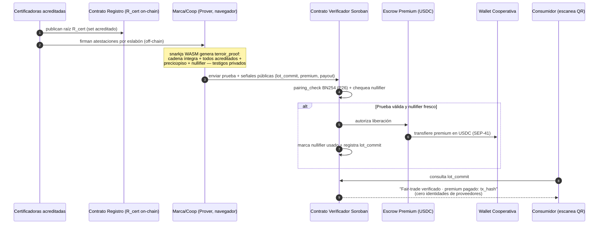

# ZK-Terroir — Procedencia justa demostrable sin revelar tu cadena de suministro

**Proyecto en profundidad** · Modelo: Opus 4.8 · Fecha: 2026-06-26 · Deadline: 2026-06-29 12:00 PST (~3 días)
**Stack:** Circom/Groth16 · proving en navegador (snarkjs WASM) · Poseidon **circomlib in-circuit** · ~~EdDSA-BabyJubjub~~ **membership Merkle (D-002)** · `pairing_check`+MSM BN254 nativo (P25/P26) · SEP-41 (USDC/EURC) · Soroban

> **⚠️ ERRATA / ESTADO (2026-07-01) — leer antes que el resto.** Este es el **spec original**; dos
> puntos fueron **superados por decisiones posteriores** (`docs/DECISIONS.md`):
> - **Curva = BN254** (no BLS12-381) — confirmado y verificado on-chain (**D-001**).
> - **Modelo de confianza = membership de Merkle (circomlib/Poseidon), NO EdDSA-BabyJubjub** (**D-002**).
>   Toda mención de "EdDSA-BabyJubjub" / firmas de certificadora abajo (§3.1, §3.2, §7) está
>   **reemplazada** por: cada certificador publica una **raíz Merkle** de atestaciones y el circuito
>   prueba *membership* por eslabón. El circuito real vigente es `circuits/terroir_chain.circom`
>   (3 eslabones, auditado sound — ver `docs/AUDIT-LOG.md`).
> - Estado de implementación real: ver `README.md` y `docs/PLAN-DIA-3.md`.
**Una frase que gana:** *"Pruebo que mi café es fair-trade en cada eslabón y le pago el premium a la cooperativa en segundos — sin revelar un solo proveedor."*

---

## 0. Tesis (el porqué profundo)

Toda cadena de suministro ética vive una **contradicción estructural**: para que el consumidor confíe, la marca debería abrir su cadena; pero esa cadena —quién le vende, a qué precio, en qué ruta— **es exactamente su ventaja competitiva**. Abrirla es regalar el negocio; no abrirla es greenwashing indemostrable. Hoy ese conflicto se "resuelve" con sellos de papel (Fairtrade, Rainforest, USDA Organic) que son auditorías puntuales, falsificables y caras, y que **no prueban nada al consumidor final** salvo un logo.

**ZK disuelve la contradicción.** Permite afirmar *"cada eslabón de esta cadena está certificado por un organismo acreditado, y el productor cobró por encima del precio piso"* **sin nombrar a ningún eslabón**. La marca conserva su moat; el consumidor obtiene una garantía matemática, no un logo. Y como Stellar mueve dinero real, **la misma prueba que certifica también libera el premium fair-trade** en USDC directo a la wallet de la cooperativa, sin intermediarios ni 8% de comisión de un banco corresponsal.

> **El insight de máxima abstracción:** Terroir no es "una app de café". Es un **motor de pruebas de procedencia sobre un grafo privado de atestaciones encadenadas**. Café es la *instancia*; el mismo circuito prueba minerales libres de conflicto, fármacos sin falsificación, halal/kosher, madera legal o textil sin trabajo forzado. Construyes un primitivo, demuestras un vertical.

---

## 1. El dolor cotidiano (y por qué ahora)

- **El fraude fair-trade/orgánico es endémico.** Estudios de cadenas de café y cacao estiman tasas de mislabeling de dos dígitos. El sello se compra una vez y se estira sobre lotes no certificados.
- **El productor cobra tarde, mal y caro.** Una cooperativa en Colombia o Etiopía recibe el premium meses después, vía corresponsalía bancaria que se queda 6–9% en fees y FX. Stellar ya es el riel de remesas de esos corredores: el premium puede llegar **en ~5s, casi sin fee**.
- **La regulación lo vuelve obligatorio, no opcional.** La **CSDDD** europea (diligencia debida en cadenas de suministro) y el **CBAM** empujan a las marcas a *probar* procedencia y condiciones — pero ninguna marca quiere publicar su lista de proveedores a la competencia. Es el momento exacto para "prueba sin revelar".
- **El consumidor ya no cree en logos.** Un QR que muestre una prueba criptográfica + un pago on-chain verificable a la cooperativa es órdenes de magnitud más creíble que un sello impreso.

**Quién paga:** marcas de specialty coffee/cacao/vino/té, retailers con compromisos ESG, certificadoras que quieren modernizar su sello, y plataformas de trazabilidad. **Quién se beneficia gratis:** la cooperativa productora.

---

## 2. Por qué ZK es load-bearing (el test "se rompe sin privacidad")

Quita la privacidad y el producto **deja de existir**, no "queda menos privado":

| Sin la pieza | Qué pasa |
|---|---|
| Sin ZK, con transparencia total | La marca revela proveedores → pierde su ventaja → **no lo hace nunca**. El producto no tiene usuarios. |
| Sin ZK, con opacidad (status quo) | "Confía en mi sello" → greenwashing indemostrable → no agrega valor sobre el papel. |
| **Con ZK** | Prueba *cada eslabón certificado + precio piso* **sin nombrar a nadie**. La marca conserva el moat y el consumidor obtiene garantía matemática. **Único punto del espacio que funciona.** |

**Modelo de amenaza concreto:** un competidor quiere reconstruir la red de proveedores de la marca a partir de su prueba pública. El diseño debe garantizar que la prueba revele **solo** los predicados públicos (todos los eslabones ∈ set de certificadores acreditados; precio ≥ piso) y **cero** identidades, montos o rutas. Eso es exactamente lo que un SNARK con testigos privados entrega.

---

## 3. Arquitectura criptográfica (el corazón técnico)

### 3.1 Modelo de datos: la cadena como grafo de atestaciones encadenadas

Una cadena de custodia es una secuencia de **eslabones** (finca → cooperativa → exportador → importador → tostador). Cada eslabón porta una o más **certificaciones** emitidas por un **certificador acreditado** (Fairtrade Int'l, Rainforest Alliance, USDA Organic…). Modelamos:

- **Registro de certificadores acreditados (patrón ASP):** árbol de Merkle con **Poseidon de circomlib (hasheado dentro del circuito)** cuyas hojas son las claves públicas de los certificadores acreditados. La **raíz `R_cert`** es pública: el contrato la guarda y la compara como un **field element opaco** — nunca recomputa el árbol on-chain. Esto es el "set limpio" que la SDF premia. *(Ver `techs-specs-zk-terroir.md` §2: todo Poseidon vive en el circuito; el contrato no usa la host function Poseidon nativa para evitar el mismatch de parámetros circomlib↔nativa.)*
- **Atestación de eslabón:** cada certificador firma con **EdDSA-BabyJubjub** (verificable barato dentro de un circuito Circom vía `eddsaposeidon`, *no* ECDSA-secp256k1):
  `attest_i = EdDSA_certifier( Poseidon(actor_i ‖ role_i ‖ cert_type_i ‖ valid_until_i ‖ lot_id ‖ commit_{i-1}) )`
  donde `Poseidon` es circomlib in-circuit y `commit_{i-1}` es el commitment del eslabón anterior → **encadena** la custodia (hash chain, también circomlib in-circuit). El `actor_i` nunca se revela: solo se usa dentro del circuito.
- **Commitment del lote (público):** `lot_commit = Poseidon(lot_id, season_id)` (circomlib, in-circuit). Es el ancla pública del lote (lo que va en el QR), sin revelar nada; el contrato lo trata como field element opaco.
- **Invoice del productor (privado):** el primer eslabón incluye `price_paid` firmado por la cooperativa; se prueba `price_paid ≥ floor_price` (range proof).

### 3.2 El circuito `terroir_proof` (Circom)

**Lo que demuestra (predicado completo):**
1. **Cadena íntegra:** para `i = 1..N`, `attest_i` verifica contra una `pk_certifier_i` y el campo encadenado `commit_{i-1}` coincide (hash chain válida de origen a lote final).
2. **Todos acreditados:** cada `pk_certifier_i` es **miembro** del árbol `R_cert` (membership Poseidon por eslabón).
3. **Origen elegible:** el eslabón origen declara `region ∈ región_permitida` y `cert_type = fair-trade ∧ organic` (igualdad sobre el primer eslabón).
4. **Precio justo:** `price_paid ≥ floor_price` (range proof sobre el invoice firmado de la cooperativa).
5. **Anti doble cobro:** `nullifier = Poseidon(lot_secret, season_id)` correctamente derivado.

**Tabla de señales:**

| Señal | Visibilidad | Significado |
|---|---|---|
| `R_cert` | pública | raíz del set de certificadores acreditados |
| `floor_price` | pública | precio piso fair-trade del período |
| `region_root` | pública | set de regiones de origen elegibles |
| `lot_commit` | pública | ancla pública del lote (QR) |
| `premium_amount` | pública | premium a liberar |
| `payout_addr` | pública | wallet de la cooperativa (destino del premium) |
| `nullifier` | pública | anti doble-cobro del premium |
| `actor_i, role_i` | **privada** | identidad de cada eslabón (el moat) |
| `attest_i, pk_certifier_i` | **privada** | firmas y claves de los certificadores |
| `merkle_path_i` | **privada** | prueba de membresía de cada certificador |
| `price_paid` | **privada** | monto pagado al productor |
| `lot_secret` | **privada** | semilla del nullifier |

**Por qué Circom/Groth16 y no RISC Zero/Noir:** el secreto lo custodia la marca/cooperativa y la prueba se genera client-side (snarkjs WASM) → RISC Zero queda descartado (no prueba en navegador). Frente a Noir/UltraHonk, **Groth16 es la verificación más barata on-chain** y la más battle-tested en Stellar (verificador en `soroban-examples`). El circuito es membership + hash-chain + un range proof: pan comido para Groth16.

### 3.3 Por qué exhibe la tecnología nueva de Stellar

- **BN254 `pairing_check` + MSM nativos (P25/P26) — el showcase load-bearing:** la verificación Groth16 on-chain corre sobre las precompilaciones nativas (pairing para la prueba; **MSM** para combinar los public inputs) → cabe en el límite de instrucciones con holgura. *Este es el guiño genuino y vivo en mainnet (P25 22-ene-2026, P26 6-may-2026).*
- **Poseidon (circomlib, in-circuit):** todos los commitments, el árbol de certificadores y la hash chain se hashean **dentro del circuito**. El contrato **no** llama a la host function Poseidon nativa (sus parámetros no coinciden con circomlib). *Showcase de Poseidon nativa = opcional/stretch, solo si se alinean parámetros; nunca en el camino crítico.*
- **ASP / privacidad cumplidora:** el set de certificadores acreditados *es* un Association Set. "Pertenezco a un set limpio certificado" sin revelar cuál.
- **SEP-41 (USDC/EURC):** el premium se paga con una llamada a la interfaz de token estándar; EURC si el corredor es europeo (CSDDD).

---

## 4. Arquitectura de sistema



### 4.1 Contrato Soroban (interfaz)

```rust
// Pseudocódigo de la interfaz del verificador/escrow
pub struct TerroirVerifier;

impl TerroirVerifier {
    // Admin: setea la raíz del set de certificadores acreditados
    fn set_certifier_root(env, admin, r_cert: BytesN<32>);

    // Núcleo: verifica la prueba y libera el premium
    fn claim_premium(
        env,
        proof: Groth16Proof,        // A, B, C
        public_inputs: PublicInputs, // R_cert, floor, region_root, lot_commit,
                                     // premium_amount, payout_addr, nullifier
    ) -> Result<(), Error> {
        require!(public_inputs.r_cert == storage.certifier_root, BadRoot);
        require!(!storage.nullifiers.contains(public_inputs.nullifier), DoubleClaim);
        // verificación nativa BN254 (P26)
        require!(verify_groth16(&VK, &proof, &public_inputs), BadProof);
        storage.nullifiers.insert(public_inputs.nullifier);
        storage.lots.insert(public_inputs.lot_commit, env.ledger().timestamp());
        token_client.transfer(&escrow, &public_inputs.payout_addr, &premium_amount); // SEP-41
        Ok(())
    }

    // Consumidor: prueba pública de procedencia para el QR
    fn lot_status(env, lot_commit: BytesN<32>) -> LotStatus; // verificado + tx del pago
}
```

**Almacenamiento:** `certifier_root`, `Map<nullifier, ()>`, `Map<lot_commit, timestamp/tx>`. Todo auditable, nada que revele proveedores.

---

## 5. El slice vertical para 3 días (qué es real, qué se mockea)

**Recorte brutal:** un producto (café), una cadena de **3 eslabones** (finca certificada → cooperativa → tostador), un premium, un nullifier.

| Componente | Estado | Nota |
|---|---|---|
| Circuito `terroir_proof` (3 eslabones) | **REAL** | membership Poseidon + hash chain + range proof |
| Proving en navegador (snarkjs WASM) | **REAL** | el momento "wow": la prueba se genera local |
| Verificación on-chain (Groth16, BN254 nativo) | **REAL** | sobre `soroban-examples/groth16_verifier` |
| Pago del premium en USDC testnet (SEP-41) | **REAL** | prueba válida → dinero se mueve |
| QR del consumidor → estado del lote | **REAL** (simple) | lee `lot_status` |
| Firmas de las certificadoras | **MOCK honesto** | claves de prueba; documentado en README |
| El árbol R_cert | semi-mock | poblado con certificadoras de juguete + algunas reales |
| Invoice de la cooperativa | **MOCK honesto** | JSON firmado de prueba |

**Regla de honestidad (la convocatoria la premia):** el README dice exactamente qué es mock (firmas/invoice) y qué es real (circuito, verificación, pago). "Honest work-in-progress > polished mystery".

---

## 6. Plan de 3 días (sprint real)

**Día 1 — Spike de riesgo + circuito mínimo.**
- Clonar/desplegar `groth16_verifier`, verificar una **prueba dummy on-chain** y medir costo. *(único riesgo que hunde el proyecto)*.
- Escribir el circuito de **1 eslabón** (membership Poseidon + verificación de firma + nullifier). Generar prueba con snarkjs. *Hito: prueba real de 1 eslabón verifica on-chain.*

**Día 2 — Cadena completa + pago.**
- Extender a **3 eslabones encadenados** + range proof del precio piso.
- Contrato `claim_premium`: verifica + nullifier + transfiere USDC testnet (SEP-41). *Hito: prueba válida → premium pagado a la wallet de la coop.*

**Día 3 — UX + QR + video.**
- Frontend: la marca carga la cadena (mock), genera la prueba **en el navegador**, ve el pago; el consumidor escanea el QR y ve "verificado + tx".
- README honesto + grabar el video de 2–3 min.

---

## 7. Modelo de amenaza y respuestas (lo que un jurado técnico atacará)

| Ataque / pregunta del jurado | Respuesta de diseño |
|---|---|
| "¿La prueba filtra proveedores?" | No: identidades/montos/rutas son testigos **privados**; solo se exponen predicados (∈ set acreditado, ≥ piso). |
| "¿Pueden reclamar el premium dos veces?" | Nullifier `Poseidon(lot_secret, season_id)` registrado on-chain → doble-cobro rechazado. |
| "¿Y si una certificadora no es real?" | Solo cuentan las del árbol `R_cert` (membership). Un certificador no acreditado → la prueba no cierra. |
| "¿Esto no lo hace un sello normal?" | El sello no demuestra *cada eslabón* ni dispara el pago. Aquí la **prueba y el dinero son lo mismo**. |
| "¿Por qué blockchain / por qué Stellar?" | El premium cross-border en USDC a un país emergente, en ~5s, casi sin fee, es justo el caso insignia de Stellar; + verificación con **BN254/MSM nativos** (P25/P26). |
| "Cadena de custodia falsa con datos inventados" (garbage-in) | ZK prueba *integridad*, no veracidad del mundo físico. Honestidad: la confianza raíz son las firmas de certificadores acreditados; ZK garantiza que nadie las falsifica ni encadena mal. (Igual que cualquier credencial verificable.) |
| "Las certificadoras reales (Fairtrade/USDA) no firman en BabyJubjub" | Cierto: en producción un **oráculo de atestación** reempaqueta su PKI X.509/PGP en credenciales BabyJubjub firmadas. No es tecnología faltante, es onboarding de datos; en el MVP el emisor es **mock honesto** (documentado en README). |

---

## 8. El video que gana (guion, 2–3 min)

> *"Este café dice ser fair-trade. ¿Lo crees? Hoy solo tienes un logo. Mira esto: escaneo el QR y veo una **prueba matemática** de que cada eslabón —de la finca al tostador— está certificado por un organismo acreditado, y que el productor cobró por encima del precio justo. Y aquí está el premium, pagado a la cooperativa en Colombia, en USDC, hace 5 segundos, on-chain. ¿Lo mejor? La marca **no reveló un solo proveedor** — su cadena sigue siendo secreta. La prueba se generó en mi navegador; los datos nunca salieron. Esto es ZK haciendo trabajo real sobre dinero real: confianza sin desnudez."*

**Plano técnico clave (una diapositiva):** finca→coop→tostador, cada flecha con un candado "∈ set acreditado", el invoice con "≥ piso", y una sola flecha pública saliendo: `prueba → USDC a la coop`. Todo lo de adentro, en gris ("privado").

---

## 9. Diferenciación y abstracción (máximo nivel)

**Vs la pila de privacy-pools que verá el jurado:** casi todos harán "transferencia blindada genérica". Terroir es **privacidad con propósito económico**: la prueba no oculta por ocultar, *libera un pago condicionado a un predicado del mundo real*. Es ZK + Stellar **inseparables**.

**La generalización (el primitivo reutilizable):**
> `Prueba de procedencia = ∃ camino en un grafo privado de atestaciones, donde cada nodo ∈ un set acreditado (ASP) y se cumple un predicado económico (≥ piso), que libera un pago O(1) on-chain.`

Instancias del mismo motor, cambiando el `cert_type` y el predicado:
- **Minerales de conflicto** (3TG): cada eslabón ∈ smelters auditados RMI.
- **Farma anti-falsificación:** cada lote ∈ fabricantes GMP + cadena de frío bajo umbral.
- **Madera legal / FLEGT, textil sin trabajo forzado, halal/kosher, pesca sostenible (MSC).**
- **Crédito de carbono con procedencia:** cada tonelada ∈ proyectos verificados.

Eso es lo que convierte un hack de fin de semana en una **tesis de producto**: ganas el hackathon con café y sales con un primitivo de trazabilidad confidencial.

---

## 10. Viabilidad comercial

- **Comprador:** marcas specialty (café/cacao/vino/té), retailers con mandato ESG, plataformas de trazabilidad (que integran el SDK), certificadoras modernizando su sello.
- **Modelo:** SaaS por volumen de lotes verificados + fee mínimo sobre el premium liquidado (rail Stellar ≈ gratis, captura un spread ínfimo).
- **Por qué ahora:** CSDDD/CBAM convierten "probar procedencia sin filtrar proveedores" de *nice-to-have* a *obligación regulatoria con deadline*. Y Stellar ya es el riel de pago a productores de mercados emergentes.
- **Foso:** el efecto red del registro de certificadores acreditados + integraciones con sellos existentes.

---

## 11. Riesgos y mitigaciones

| Riesgo | Sev. | Mitigación |
|---|---|---|
| Costo de verificación on-chain no cabe | Media | Groth16 (no UltraHonk); medir Día 1 con prueba dummy. |
| Circuito de hash-chain más complejo de lo esperado | Media | Recortar a 3 eslabones fijos; profundidad de Merkle pequeña. |
| "Garbage-in" (datos físicos falsos) debilita el claim | Baja-Media | Encuadrar honestamente: ZK = integridad de credenciales, no oráculo físico. Confianza raíz = certificadores. |
| Alcance (QR + UX + circuito en 3 días) | Media | Priorizar el flujo prueba→pago; el QR es read-only simple. |
| "¿Por qué no solo una BD?" | Baja | Una BD no es auditable por terceros ni mueve el pago sin un banco. On-chain + ZK sí. |

---

## 12. Checklist de entrega (requisitos del hackathon)

- [ ] Repo open-source + README honesto (mock vs real explícito).
- [ ] ZK **load-bearing**: sin él, no hay producto (ver §2).
- [ ] Integra Stellar: verificación on-chain + pago USDC testnet.
- [ ] Video 2–3 min mostrando proving en navegador → verificación → pago.
- [ ] Exhibe tecnología nueva: **BN254 + MSM nativos** (P25/P26), ASP, SEP-41. *(Poseidon = circomlib in-circuit, no nativa on-chain.)*
